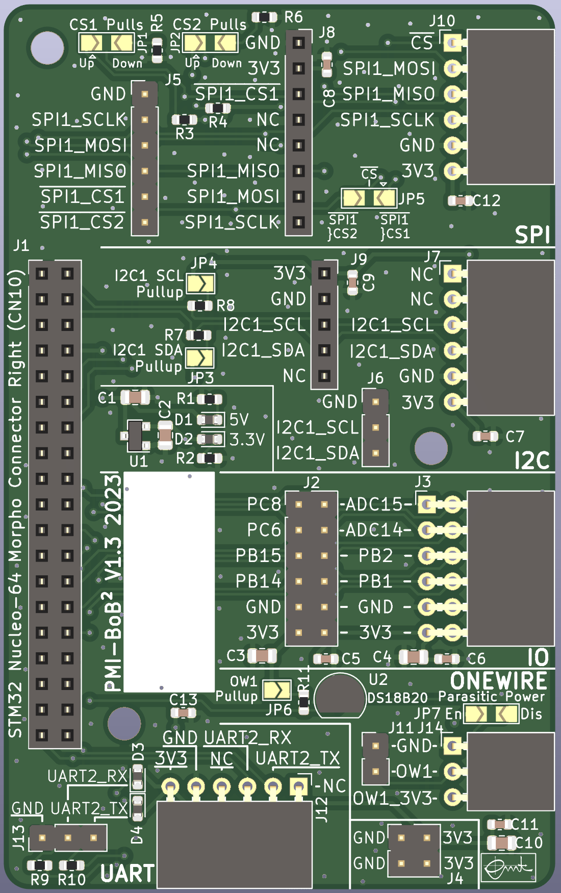

# PMI backplane BreakOut Board for BreakOut Boards (BoB²)

This pcb is designed for the course PMI (Practical course Microcontroller
and Interface electronics) as a breakout board for right morpho connector
(CN10) of [STM32 Nucleo-64 boards](https://www.st.com/en/evaluation-tools/stm32-nucleo-boards.html). It distributes several signals and bus systems like SPI, I²C, 1-wire, UART and GPIOs. Signal distribution is achieved by pin sockets and headers. The headers can be used to tap signal for anaysis with oscilloscopes or logic analyzers. It also features a 3.3V LDO voltage regulator for power supply and an on board 1-wire DS18B20+ temperature sensor. SPI Chip selects, I²C pull-up resistors and 1-wire parasitic power supply can be enabled over solder bridges.

There are interfaces for GY-291 (ADXL345 accelerometer) and GY-271 (HMC5883L magnet sensor) as well as for our [PMI-ALICE](https://github.com/emtpb/pmi-hw-alice) and [PMI-CARLOS](https://github.com/emtpb/pmi-hw-carlos) breakout boards. Vertical pin sockets are compatible with
[Digilents Pmod](https://digilent.com/reference/pmod/start) interfaces.

An interactive html BOM file with pcb layout and material placement can be
found [here](bom/ibom.html).

# Changelog

## V1.0
* First prototype

## V1.1
* First release

## V1.2
* onewire: Add parasitic power bridge
* pcb: Increase spacing between power section and morpho socket
